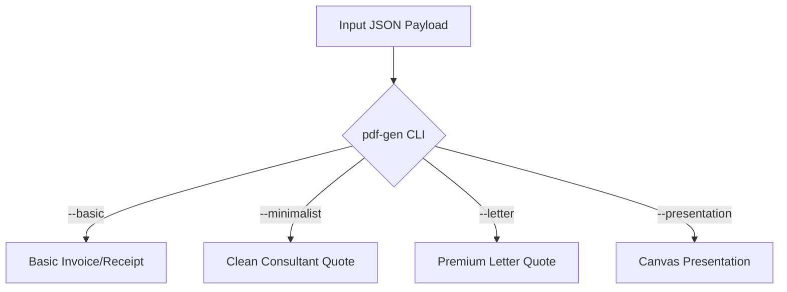

# Zig PDF Generator CLI & Library

A high-performance, premium PDF generation engine written in Zig 0.16.0. It provides an extremely fast, zero-dependency CLI and a binary-clean C FFI for generating beautiful, pixel-perfect PDF documents from structured JSON payloads.

---

## UNIX Philosophy & Stream Isolation

The `pdf-gen` CLI tool is built to integrate seamlessly with standard UNIX pipelines and automated build environments:

1. **Unbounded Stdin Parsing**: If no input file is specified, the CLI streams the input JSON from standard input (`stdin`) up to a **50MB safety threshold**, accommodating extremely large embedded base64 images or watermarks.
2. **Binary-Clean Stdout Isolation**: If no output file is specified, the generated raw PDF bytes are written directly to standard output (`stdout`). Standard output is guaranteed to be completely binary-clean.
3. **Stderr Routing for Diagnostics**: All diagnostic messages, informational headers, generator warnings, and parsing errors are written strictly to standard error (`stderr`) to prevent stream pollution.
4. **Flag Exclusivity Validation**: The four core template flags are strictly mutually exclusive. If multiple template flags are passed, the CLI immediately prints a validation error to `stderr` and exits with code `1`.

### CLI Command Reference

```bash
# Compile the CLI executable
zig build

# View CLI options and help
./zig-out/bin/pdf-gen --help

# Method A: Standard File-to-File Invocation (Defaults to --basic)
./zig-out/bin/pdf-gen input.json output.pdf

# Method B: Absolute UNIX Pipelining (JSON on stdin -> PDF on stdout)
cat input.json | ./zig-out/bin/pdf-gen --letter > output.pdf

# Method C: Mixed Streaming
./zig-out/bin/pdf-gen --minimalist input.json > output.pdf
```

> [!IMPORTANT]
> The template selection flags (`--basic`, `--minimalist`, `--letter`, `--presentation`) are mutually exclusive. Passing more than one flag will result in an error:
> ```bash
> $ ./zig-out/bin/pdf-gen --basic --letter input.json
> Error: Multiple template flags specified. Template flags (--basic, --minimalist, --letter, --presentation) are mutually exclusive.
> ```

---

## Standardized Template Modes & Schemas

Each mode accepts a specific JSON schema mapping exactly to our high-performance Zig backend data structures.



---

### 1. Basic Template (`--basic`)
The standard professional invoice/receipt template. Ideal for traditional invoices, receipts, and transactional billing.

#### Key Zig Struct Mapping (`InvoiceData`)
* **`document_type`** (`string`, optional): `"invoice"` or `"quote"`. Affects semantic labels.
* **`company_name`** (`string`, optional)
* **`company_address`** (`string`, optional)
* **`company_vat`** (`string`, optional)
* **`company_logo_base64`** (`string`, optional): Base64-encoded PNG/JPEG logo image.
* **`client_name`** (`string`, optional)
* **`client_address`** (`string`, optional)
* **`client_vat`** (`string`, optional)
* **`invoice_number`** (`string`, optional)
* **`invoice_date`** (`string`, optional)
* **`due_date`** (`string`, optional)
* **`items`** (`array`, optional): List of line item objects:
  * `description` (`string`)
  * `quantity` (`number` / float)
  * `unit_price` (`number` / float)
  * `total` (`number` / float, auto-calculated if omitted)
* **`subtotal`** (`number` / float, optional)
* **`tax_rate`** (`number` / float, optional): Decimal fraction (e.g. `0.21` for 21% VAT).
* **`tax_amount`** (`number` / float, optional)
* **`total`** (`number` / float, optional)
* **`primary_color`** (`string`, optional): Hex color (e.g., `"#627eea"`) for accents and branding.
* **`notes`** (`string`, optional)

#### Canonical Payload Example
```json
{
  "document_type": "invoice",
  "company_name": "Quantum Labs",
  "company_address": "789 Blockchain Ave, Crypto City, CC 12345",
  "company_vat": "US987654321",
  "client_name": "DeFi Protocol Inc",
  "client_address": "123 Smart Contract Blvd, Web3 Town",
  "client_vat": "US123456789",
  "invoice_number": "CRYPTO-2026-001",
  "invoice_date": "2026-01-04",
  "due_date": "2026-01-14",
  "items": [
    {"description": "Smart Contract Development", "quantity": 40.0, "unit_price": 250.0, "total": 10000.0},
    {"description": "Security Audit", "quantity": 1.0, "unit_price": 5000.0, "total": 5000.0}
  ],
  "subtotal": 15000.0,
  "tax_rate": 0.21,
  "tax_amount": 3150.0,
  "total": 18150.0,
  "primary_color": "#627eea",
  "notes": "Payment accepted in USD or equivalent cryptocurrency."
}
```

---

### 2. Minimalist Template (`--minimalist`)
A clean, white-paper layout utilizing a single accent color. The document type (QUOTE, INVOICE, HANDOVER, or INSPECTION) is automatically derived from the prefix of the `reference` field (e.g. `QTE-`, `INV-`, `HND-`, `INS-`).

#### Key Zig Struct Mapping (`ProposalData`)
* **`company_name`** (`string`, optional)
* **`company_address`** (`string`, optional)
* **`client_name`** (`string`, optional)
* **`client_address`** (`string`, optional)
* **`reference`** (`string`, optional): Driving reference identifier.
* **`date`** (`string`, optional)
* **`valid_until`** (`string`, optional)
* **`primary_color`** (`string`, optional): Accent hex color (e.g. `"#16a34a"`).
* **`sections`** (`array`, optional): List of sections containing content:
  * `section_type` (`string`): `"text"`, `"metrics"`, or `"table"`.
  * `heading` (`string`, optional)
  * `content` (`string`, optional): Used for `"text"` sections. Bullet formatting supported with leading `- ` or `* `.
  * `metric_items` (`array`, optional): Used for `"metrics"` sections. Format: `[{"label": "...", "value": "..."}]`.
  * `table_items` (`array`, optional): Used for `"table"` sections. Format: `[{"description": "...", "quantity": 1.0, "unit_price": 100.0, "total": 100.0}]`.
  * `subtotal` / `tax_rate` / `total` (`number` / float, optional): Financial sum lines on tables.
* **`footer`** (`object`, optional): Contact and metadata details:
  * `phone` (`string`, optional)
  * `email` (`string`, optional)
  * `website` (`string`, optional)
  * `dashboard_url` (`string`, optional): Renders an automatic QR code linking here on the final page.

#### Canonical Payload Example
```json
{
  "company_name": "Green Energy Solutions",
  "company_address": "456 Solar Way, eco-District",
  "client_name": "Ocean View Residency",
  "client_address": "88 Coastal Road, Marine Bay",
  "reference": "QTE-2026-889",
  "date": "2026-05-28",
  "valid_until": "2026-06-28",
  "primary_color": "#16a34a",
  "sections": [
    {
      "section_type": "text",
      "heading": "Project Overview",
      "content": "We propose a full residential solar grid installation.\n- 12x high-efficiency monocrystalline panels.\n- Smart grid microinverter with real-time analytics."
    },
    {
      "section_type": "metrics",
      "heading": "Projected Performance",
      "metric_items": [
        {"label": "Annual Generation", "value": "5.4 MWh"},
        {"label": "CO2 Displaced", "value": "2.1 Tons/yr"}
      ]
    },
    {
      "section_type": "table",
      "heading": "Financial Investment",
      "table_items": [
        {"description": "Photovoltaic Panel Array", "quantity": 12.0, "unit_price": 350.0, "total": 4200.0},
        {"description": "Grid Inverter & Storage Kit", "quantity": 1.0, "unit_price": 2800.0, "total": 2800.0}
      ],
      "subtotal": 7000.0,
      "tax_rate": 0.05,
      "total": 8400.0
    }
  ],
  "footer": {
    "phone": "+44 20 7946 0958",
    "email": "install@greenenergy.co.uk",
    "website": "www.greenenergy.co.uk",
    "dashboard_url": "https://portal.greenenergy.co.uk/quotes/QTE-2026-889"
  }
}
```

---

### 3. Premium Letter Template (`--letter`)
A premium, multi-page layout utilizing embedded Montserrat typography, elegant gold hairline separators, an optional watermark, and a formal letter structure. Best suited for high-value contractor quotes.

#### Key Zig Struct Mapping (`LetterQuoteData`)
* **`company`** (`object`): Centered title and subtitle block:
  * `name` (`string`)
  * `phone` (`string`)
  * `email` (`string`)
* **`client`** (`string`): Recipient client name.
* **`date`** (`string`)
* **`style`** (`object`):
  * `primary_color` (`string`): Title/header hex color (e.g. `"#1a2a5e"`).
  * `accent_color` (`string`): Hairlines and total highlights (e.g. `"#e8a83d"`).
  * `font_family` (`string`): `"montserrat"` (triggers premium embedded TrueType) or `"helvetica"`.
  * `watermark_image` (`string`, optional): Filepath or base64 data-URL.
  * `watermark_opacity` (`number` / float, optional): 0.0–1.0.
  * `watermark_scale` (`number` / float, optional): Width percentage.
* **`pages`** (`array`): Distinct pages of types `"description"` (prose block) or `"itemized"` (cost quote sheets):
  * `type` (`string`): `"description"` or `"itemized"`.
  * `blocks` (`array`, description only): Content items containing heading, paragraphs, and lists. Supporting inline `**bold**` formatting.
  * `sections` (`array`, itemized only): Section groupings of item lines.
  * `subtotal` / `tax_rate` / `total` (`number` / float)
  * `subtotal_text` / `tax_text` / `total_text` (`string`): Formatted localized currency representations.

#### Canonical Payload Example
> [!TIP]
> This is the verified canonical Spanish-reforms payload used for high-end residential quote generation.

```json
{
  "company": {
    "name":  "REFORMAS COSTA SOL",
    "phone": "+34 623194238",
    "email": "info@reformascostasol.com"
  },
  "client": "MARI CRUZ",
  "date":   "17/11/2025",
  "style": {
    "primary_color":     "#1a2a5e",
    "accent_color":      "#e8a83d",
    "font_family":       "montserrat",
    "watermark_image":   "templates/reformas_watermark.png",
    "watermark_opacity": 0.08,
    "watermark_scale":   0.55
  },
  "pages": [
    {
      "type": "description",
      "blocks": [
        { "type": "heading",   "text": "Proyecto reforma integral de vivienda (100 m²)." },
        { "type": "paragraph", "text": "Realizaremos una reforma integral orientada a transformar por completo la vivienda..." }
      ]
    },
    {
      "type": "itemized",
      "subtitle":            "PRESUPUESTO ESTIMADO",
      "project_label":       "DESCRIPCIÓN DE PROYECTO",
      "project_description": "REFORMA INTEGRAL DE PISO",
      "sections": [
        {
          "heading": "CUARTO DE BAÑO",
          "items": [
            "RETIRADA DE ACCESORIOS SANITARIOS ANTIGUOS"
          ]
        }
      ],
      "currency":      "€",
      "subtotal":      20310.00,
      "tax_rate":      0.21,
      "total":         24575.10,
      "subtotal_text": "€20.310",
      "tax_text":      "€4.265,10",
      "total_text":    "€24.575,10"
    }
  ]
}
```

---

### 4. Presentation Template (`--presentation`)
A freeform multi-page canvas-style engine where elements (text, bulleted lists, tables, shapes, and images) are absolutely positioned on a custom grid (default: 1080p layout). Excellent for rich marketing proposals or customized reporting slide decks.

#### Key Zig Struct Mapping (`PresentationData`)
* **`page_size`** (`object`, optional): Width/height in points. Defaults to `1920` x `1080`.
* **`default_font_size`** (`number` / float, optional): Default `24`.
* **`default_text_color`** (`string`, optional): Default `"#000000"`.
* **`default_background`** (`string`, optional): Default `"#ffffff"`.
* **`pages`** (`array`): Distinct slide page arrays with background and positioning elements:
  * `background_color` (`string`, optional)
  * `elements` (`array`): List of positioning components:
    * `type` (`string`): `"text"`, `"bullet_list"`, `"table"`, `"image"`, `"shape"`.
    * `x` / `y` (`number` / float): Top-left coordinates.
    * Elements have custom type-specific attributes (`font_size`, `items`, `columns`, `rows`, `base64`, `shape`, `fill_color`, `stroke_color`, etc.).

#### Canonical Payload Example
```json
{
  "page_size": { "width": 1920, "height": 1080 },
  "default_font_size": 24,
  "pages": [
    {
      "background_color": "#111827",
      "elements": [
        {
          "type": "shape",
          "shape": "rectangle",
          "x": 0.0,
          "y": 0.0,
          "width": 1920.0,
          "height": 160.0,
          "fill_color": "#1f2937",
          "stroke_width": 0.0
        },
        {
          "type": "text",
          "content": "Quarterly Technical Architecture Report",
          "x": 80.0,
          "y": 55.0,
          "font_size": 40.0,
          "font_weight": "bold",
          "color": "#f9fafb"
        },
        {
          "type": "bullet_list",
          "x": 100.0,
          "y": 280.0,
          "font_size": 28.0,
          "color": "#e5e7eb",
          "bullet_color": "#3b82f6",
          "line_spacing": 12.0,
          "items": [
            "Completed WASM standard memory deallocation layer",
            "Added explicit mutually exclusive flag validation to the CLI binary",
            "Isolated standard output to support high-throughput piping streams"
          ]
        }
      ]
    }
  ]
}
```

---

### Modular Cryptocurrency Payment Block

All four templates (`--basic`, `--minimalist`, `--letter`, `--presentation`) universally support an optional, premium cryptocurrency payment block (`crypto_payment`). This generates a beautiful, themed summary page (or canvas card) featuring transaction details, custom network colors, and a clean, native QR code.

To protect against transport-level floating point precision loss, the `amount` field is strictly defined and processed as a string slice.

#### Schema Definition (`CryptoPaymentBlock`)
* **`network`** (`string`): The cryptocurrency network name (e.g., `"bitcoin"`, `"ethereum"`, `"polygon"`, `"bnb"`, `"litecoin"`, `"dogecoin"`).
* **`to_address`** (`string`): The recipient's wallet address.
* **`from_address`** (`string`, optional): The sender's wallet address.
* **`amount`** (`string`, optional): The exact payment amount (e.g., `"5.50000000"`). **Must be passed as a string** to prevent IEEE-754 precision loss.
* **`currency`** (`string`, optional): Custom coin symbol override (defaults to the network's standard asset).

#### Canonical JSON Example
```json
"crypto_payment": {
  "network": "ethereum",
  "to_address": "0x742d35Cc6634C0532925a3b844Bc454e4438f44e",
  "from_address": "0x1111111111111111111111111111111111111111",
  "amount": "5.50000000",
  "currency": "ETH"
}
```

---

## Technical Validation

Every field type across these schemas maps explicitly to a field on the corresponding Zig templates, guaranteeing clean serialization. If any field types do not match, the JSON parser will throw a detailed diagnostic error to `stderr` with details of the violation.

To verify your environment, you can run the built-in test suite:
```bash
zig build test
```
*(Note: Minor pre-existing compression assertions in string-matching unit tests are a known library quirk and do not affect runtime execution of PDF generation).*
